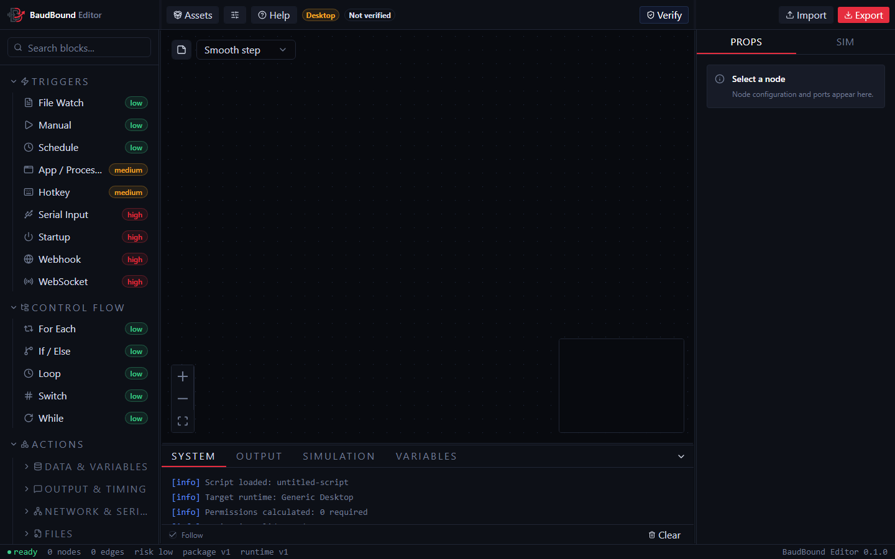

# Visual Editor

The browser editor builds a project as a connected graph. It verifies and simulates that graph, then exports a `.bbs` package for a native runner. The editor does not execute trusted production actions on the runner machine.

## Workspace

| Region | Purpose |
| --- | --- |
| **Top bar** | Return to Projects, Save, Undo, Redo, Assets, Project Settings, Help, Verify, and Export |
| **Node library** | Searchable Triggers, Control Flow, and Actions compatible with the selected target |
| **Canvas** | Executable nodes, comments, connections, selection, pan, zoom, minimap, and edge style |
| **Inspector** | Properties for the selected node and the Simulation tab |
| **Output console** | System, simulation, runtime-data, and secret-management information |
| **Status bar** | Current editor and graph status information |

The screenshot shows an empty project before verification. Labels can move as the window narrows, but the node library, canvas, inspector, output console, and status bar keep these responsibilities.

Drag the vertical dividers to resize the node library and inspector. Their widths remain bounded so the canvas stays usable. If node properties are not visible, select an executable node and open **Properties** in the inspector.

## Add and configure nodes

Search the node library, then either click a node entry to add it near the current viewport center or drag it to an exact canvas position. Nodes hidden by target compatibility cannot be added until Project Settings selects a supported runtime.

Select a node to edit:

- optional custom display name;
- definition-specific fields;
- variable-aware text and number inputs;
- conditions, switch cases, headers, serial options, or asset choices where relevant;
- runtime output data and reference examples; and
- risk and node identity.

Node IDs are stable within the project and appear in output references, edges, logs, and package data. Use the inspector copy button rather than retyping an ID.

## Connect the graph

Drag from an output handle to a compatible input handle. The edge follows the project-wide style selected in the canvas toolbar.

Ordinary nodes use an `out` execution output. Fallible actions expose **success** and **failed** outputs; the failed branch provides structured `error` data. Control nodes expose named branches such as **true**, **false**, **loop**, **done**, switch cases, or a default route.

Triggers have no execution input because they begin runs. A workflow can contain multiple trigger types, but only one Manual trigger is allowed.

Loop body edges leave the **loop** output and completion continues from **done**. Do not connect the body back to the loop node; the runtime owns repetition.

One output can connect to several nodes. Those branches run one after another in the numbered order shown on the edges. The first connection created from an output is first, and each new connection is added to the end.

Select any numbered edge to open **Execution order** in the inspector. Drag the destination rows or use the arrow buttons to move a connection earlier or later. The order belongs only to that source output. Connections from another output have their own order. Moving nodes around the canvas does not change execution order.

Select an edge to highlight it. Right-click and choose **Disconnect**, use the inspector disconnect button, or use the normal delete interaction to remove it. The remaining connections are renumbered automatically. A node cannot connect to itself. Invalid endpoints, handle names, or execution orders fail verification.

## Select and move

Click a node or edge to select it. Drag a node by its body or designated header. Drag empty canvas space to pan.

Hold `Ctrl` while dragging on empty canvas to create a selection rectangle. Selection includes executable nodes and comments that intersect the rectangle. Selected executable nodes remain above overlapping comments.

Use the React Flow controls to zoom in, zoom out, and fit the graph. The minimap shows the graph's position when the canvas extends beyond the viewport.

## Copy, paste, duplicate, and delete

Right-click an executable node or comment for **Copy**, **Duplicate**, and **Delete**. Right-click empty canvas for **Paste** after copying.

Keyboard copy and paste use `Ctrl+C` and `Ctrl+V`. When the pointer is over the canvas, paste uses that position. Otherwise it uses the viewport center. Copying a multi-selection preserves the selected nodes, comments, selected connections, and relative positions. Text inputs, textareas, code editors, content-editable elements, and active browser text selection keep their normal clipboard behavior.

Deleting an executable node also removes connected edges. Deleting a comment does not affect executable flow.

Use `Ctrl+Z` to undo and `Ctrl+Y` or `Ctrl+Shift+Z` to redo project changes. The toolbar provides the same commands and disables them when no matching history entry exists. Changes inside a focused text or code field keep the browser control's normal text-level undo behavior.

## Context menus and key capture

Canvas context menus apply to the object under the pointer. `Escape` closes an open canvas menu.

Hotkey and Keyboard node fields use a key-capture control. Focus that control before pressing the intended combination. Ordinary editor shortcuts are suppressed while an editable field has focus, preventing a captured `Ctrl+C` from copying a node.

## Comments

Add a comment from the canvas comment control. Comments are normal selectable React Flow nodes but are excluded from the executable program.

- Drag from the entire upper comment section.
- Edit text directly in the body; the cursor remains where you place it.
- Resize from the lower-right handle. Minimum size prevents controls from overlapping.
- Choose amber, blue, green, rose, or violet from the header swatches.
- Use **A-**, **A+**, or type a font size from `12` through `72`.
- Press Enter or leave the size field to apply it; Escape restores the current size.
- Copy, paste, duplicate, select, and delete comments like executable nodes.

When a comment overlaps an executable node, the executable node is rendered above it so controls and connections remain accessible.

## Edge style

The canvas edge selector applies one style to all graph edges. Available styles map to React Flow's straight, step, smooth-step, and default Bezier rendering. The selected style is editor metadata saved in `editor.json`; it does not change execution order.

## Project, assets, and packages

The editor opens on the Projects screen. Create a local project there or use **Open package** to import a verified `.bbs` file. Inside a project, use **Project Settings** for editable metadata and target settings, **Assets** for package-owned files, **Save** to commit work to browser storage, and **Export** to review and download a revision.

Read [Projects, Assets, and Export](projects-assets-export.md) before editing an imported production package.

## Verification and simulation

**Verify** runs all editor checks and updates the top-bar status to Not verified, Verified, Warnings, or Failed. Graph changes invalidate the previous result.

The **Simulation** inspector tab presents each trigger and controlled payload fields. Triggering simulation always verifies first. Use runtime overrides to force fallible nodes down success or failed branches, adjust execution speed, inspect logs and variables, and choose **Stop** to cancel an active session.

See [Verification and Simulation](simulation.md) for exact rule and payload behavior.

## Browser persistence and backups

Saved projects and assets are stored in IndexedDB in the current browser profile. `Ctrl+S` and the toolbar Save button commit the complete project. The status bar shows whether the project is saved, unsaved, saving, or failed to save. Reloading a saved project URL restores that project.

One tab owns editing for each project. Other tabs show a takeover screen. A clean project can transfer control immediately, but the editor refuses takeover while the current owner has unsaved changes.

Returning to Projects with unsaved changes asks whether to save, discard, or cancel. Reloading or closing the browser tab with unsaved changes uses the browser's standard warning.

A failed save never replaces the previous stored revision. Keep the page open, read the recovery dialog, and retry or choose **Export current project**. A storage notice means the browser did not grant protected storage. The project still works, but it remains dependent on the current browser profile and available browser storage.

Export before clearing browser data, switching profiles or devices, using private browsing, resetting the project, or making a risky graph change. Back up exported packages in normal versioned storage.

## Common problems

| Problem | Resolution |
| --- | --- |
| Inspector looks empty | Select an executable node and open Properties |
| Node is missing from library | Check target runtime compatibility and clear the library search |
| Connection will not verify | Reconnect exact named output and input handles, remove stale edges, and review numbered fan-out order |
| `Ctrl` drag does not select | Begin on empty canvas, keep Ctrl held, and include the node bounds |
| Copy affects text instead of node | Remove browser text selection and focus the canvas node |
| Comment controls overlap | Resize the comment wider or reduce its font size |
| Imported package is rejected | Return to Projects, use Open package, and inspect the verification error |
| Project is already open | Continue in the owning tab, or take control after its changes are saved |
| Save failed | Keep the tab open, retry the save, or export the current project from the recovery dialog |
| Work disappeared | Check the original browser profile; restore from the latest exported package |

Continue with [Node Reference](node-reference.md) and [Variables and Data](variables.md).
